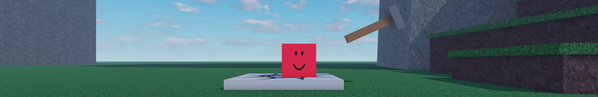

<div align="center">

# block and hammer [recode]

</div>

<div align="center">


[](https://github.com/tophatDev-roblox/block-and-hammer/blob/main/LICENSE)
[](https://discord.gg/fN4sVUngdS)

</div>

<div align="center">

[](https://roblox-ts.com/)
[](https://centurion.paradoxum.dev)
[](https://github.com/1ForeverHD/TopbarPlus)
[](https://github.com/boatbomber/NumberSpinner)

</div>

## building from source

> [!WARNING]
> this game is currently in pre-alpha, so place files are currently not yet provided

### prerequisites
* [git](https://git-scm.com/downloads)
* [pnpm](https://pnpm.io/installation)
* [Rojo](https://rojo.space)

---

1. clone this repository
```bash
git clone https://github.com/tophatDev-roblox/block-and-hammer
cd block-and-hammer
```
2. install dependencies
```bash
pnpm i
```
3. watch/build with roblox-ts and serve with Rojo
```bash
pnpm watch
```
```bash
rojo serve
```
4. download the place file from the [latest release](https://github.com/tophatDev-roblox/block-and-hammer/releases/latest) then open it in Roblox Studio
5. once in the place, connect the Rojo plugin and you should be able to play the game

**note:** not all files are included, which means that you cannot access some in-game features (e.g. replays)
